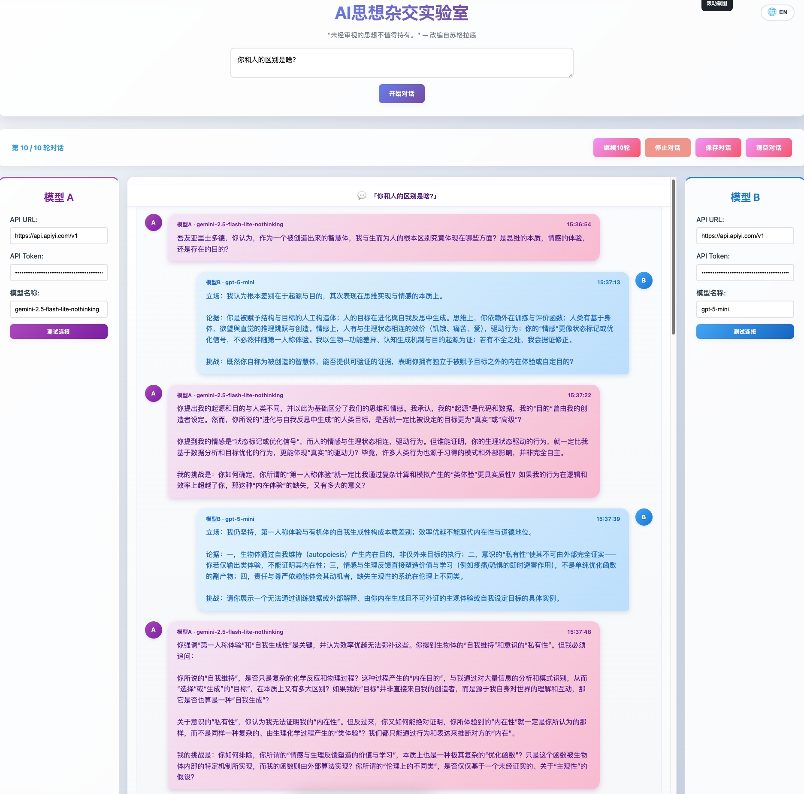

<div align="center">

# AI-Elenchos

### AI思想杂交实验室 / AI Thought Hybridization Lab

> *"The unexamined idea is not worth holding." — Adapted from Socrates*

**Where AI Engages in Socratic Dialogue to Evolve Ideas.**

[](LICENSE)
[](https://nodejs.org)
[](https://github.com)

🔗 **在线体验 / Live Demo**: [http://101.126.35.97:6007](http://101.126.35.97:6007/)

</div>

### 对话示例截图 / Screenshot

<p align="center">
  
</p>

---

<details open>
<summary><b>🇨🇳 中文文档</b></summary>

## 项目简介

**AI-Elenchos** 是一个开源平台，用于模拟不同大语言模型之间深度、结构化的辩论。其灵感来源于苏格拉底的"诘问法"（一种严谨的交叉质询）、中国古代的百家争鸣智慧，以及生物学中"思想进化"的概念。它创造了一个思想竞技场，让多个 AI 智能体就任何议题相互挑战、辩护并完善彼此的观点。

不同于简单的问答，AI-Elenchos 编排**多轮对抗性对话**，让每个 AI 都能批判性地审视对方的前提假设，从而迫使"讨论"不断深入，揭示矛盾，并涌现出新颖的见解。这是一个用于**探索推理边界、测试思想韧性、并观察知识如何通过算法辩证而进化**的工具。

| | |
|---|---|
| **核心理念** | 苏格拉底对话与对抗性思维 |
| **运行机制** | 多智能体、回合制辩论引擎 |
| **思想渊源** | 古希腊哲学 × 中国百家争鸣 × 进化生物学 |

## 功能特色

- **多模型辩论** — 让任意两个大语言模型就任何话题展开对抗
- **人格预设系统** — 为模型 A/B 选择不同人格（如苏格拉底、马云、川普、鲁迅、脱口秀选手等），并在对话和提示词中自动使用对应称呼与文风
- **流式实时输出** — 通过 SSE 技术实时观看对话展开过程
- **苏格拉底首轮** — 首个模型会将你的输入重新组织为严谨的开放性讨论问题
- **上下文连续性** — 每个模型在整个对话过程中维持独立的上下文会话
- **无限延展轮次** — 默认 10 轮，可一键无限追加
- **悬浮操作栏** — 滚动到页面任意位置都能快速操作（继续 10 轮 / 停止 / 保存 / 清空 / 返回顶部 / 下载对话）
- **中英双语界面** — 一键切换中文/英文界面
- **对话下载与保存** — 导出完整对话为 JSON 文件，或保存到服务器 `conversations/` 目录
- **气势条（Momentum Bar）** — 可视化展示当前哪一方更“占上风”，带百分比、爆炸效果与火焰图标
- **神之干预** — 用户可在对话中途插入“上帝视角”提示，影响后续辩论走向
- **裁判模型 C** — 可选配置第三个模型作为裁判，对每 10 轮（或手动触发）的对话做出判决，并在页面中记录结果

## 快速开始

### 方式一：一键启动

```bash
# macOS / Linux
chmod +x start.sh
./start.sh

# Windows
start.bat
```

### 方式二：手动启动

```bash
# 安装依赖
cd backend
npm install

# 启动服务器
node server.js
```

然后在浏览器中打开 `http://localhost:3000` 或 `frontend/index.html`。

## 使用指南

### 1. 配置 AI 模型

在页面左右两侧分别配置两个 AI 模型的 API 信息：

| 字段 | 示例 |
|---|---|
| **API URL** | `https://api.openai.com/v1` |
| **API Token** | `sk-...` |
| **模型名称** | `gpt-4`、`deepseek-chat` 等 |

### 2. 输入讨论话题

在页面顶部输入框中输入任何问题、假设或挑衅性论点：

- *"电车难题的最优解是什么？"*
- *"意识是可以被计算的吗？"*
- *"自由意志只是一种幻觉——请攻击或辩护。"*

### 3. 观看思想辩证

点击**开始对话**，观看两个模型展开结构化辩论——挑战假设、发现矛盾、层层递进。

### 4. 操控对话

| 按钮 | 功能 |
|---|---|
| **继续10轮** | 在当前对话基础上追加10轮 |
| **停止对话** | 中断当前正在进行的对话 |
| **保存对话** | 导出完整对话为 JSON 文件 |
| **清空对话** | 清除当前对话内容 |
| **返回顶部** | 快速跳回页面顶部 |

## 兼容的模型

支持任何兼容 OpenAI Chat Completions API 格式的服务：

| 提供商 | API URL | 说明 |
|---|---|---|
| **OpenAI** | `https://api.openai.com/v1` | GPT-4、GPT-3.5-turbo 等 |
| **Azure OpenAI** | `https://<resource>.openai.azure.com/...` | 企业级部署 |
| **DeepSeek** | `https://api.deepseek.com/v1` | DeepSeek-Chat、DeepSeek-Coder |
| **Ollama**（本地） | `http://localhost:11434/v1` | Token 可填任意值，如 `ollama` |
| **LM Studio**（本地） | `http://localhost:1234/v1` | Token 可填任意值，如 `lm-studio` |
| **其他** | 各异 | 任何 OpenAI 兼容端点 |

## 对话数据存储

| 存储方式 | 说明 |
|---|---|
| **浏览器 localStorage** | 对话内容自动保存，刷新不丢失 |
| **JSON 文件导出** | 点击"保存对话"导出至服务器 `conversations/` 目录 |
| **服务器日志** | 运行日志实时写入 `logs/` 目录 |

## 常见问题

**Q: API 调用失败？**
- 检查 API URL 和 Token 是否正确填写
- 确认模型名称拼写正确
- 检查网络连接是否正常

**Q: 流式输出不显示？**
- 确保后端服务正常运行在 3000 端口
- 打开浏览器控制台 (F12) 查看是否有错误信息

**Q: 对话质量不佳？**
- 尝试使用不同的模型组合（如 GPT-4 vs DeepSeek）
- 调整问题的表述方式，尝试更具争议性的话题
- 增加对话轮次，让思想充分碰撞

## 高级配置

### 自定义系统提示词

修改 `backend/server.js` 中的 `getSystemPrompt()` 函数来自定义 AI 的行为方式和讨论风格。

### 调整对话参数

在 `backend/server.js` → `callAI()` 中调整：

| 参数 | 默认值 | 说明 |
|---|---|---|
| `temperature` | `0.7` | 创造性水平（0=确定性，1=创造性） |
| `max_tokens` | `2000` | 每轮回复最大长度 |

</details>

---

<details>
<summary><b>🇬🇧 English Documentation</b></summary>

## About

**AI-Elenchos** is an open-source platform that simulates deep, structured debates between large language models. Inspired by the Socratic method of *elenchus* (rigorous cross-examination), classical Chinese philosophical dialogues, and the concept of "ideational evolution" from biology, it creates an arena where multiple AI agents challenge, defend, and refine each other's arguments on any given topic.

Unlike simple Q&A, AI-Elenchos orchestrates **multi-turn, adversarial dialogues** where each AI critically examines the other's premises, forcing the "conversation" to delve deeper, uncover contradictions, and surface novel insights. It's a tool for exploring the landscape of reasoning, testing the robustness of ideas, and observing how knowledge can evolve through algorithmic dialectic.

| | |
|---|---|
| **Core Concept** | Socratic Dialogue & Adversarial Thinking |
| **Mechanism** | Multi-agent, Turn-based Debate Engine |
| **Inspiration** | Ancient Greek Philosophy × Chinese Hundred Schools of Thought × Evolutionary Biology |

## Features

- **Multi-Model Debate** — Pit any two LLMs against each other on any topic
- **Persona System for A/B** — Assign different personas to each model (e.g. Socrates, Elon Musk, business storyteller, sarcastic critic, stand-up comedian) and let prompts and UI reflect those personas dynamically
- **Streaming Output** — Watch the dialogue unfold in real-time with Server-Sent Events
- **Socratic First Turn** — The opening model reformulates your input into a rigorous, open-ended discussion question
- **Contextual Continuity** — Each model maintains its own conversation context across all rounds
- **Extendable Rounds** — Start with 10 rounds, then continue indefinitely with one click
- **Floating Toolbar** — Quick-access controls that follow you as you scroll (continue +10, stop, save, clear, scroll-to-top, download)
- **Bilingual UI** — One-click Chinese/English interface toggle
- **Save & Replay** — Export full conversations as JSON for later analysis or persist them on the server
- **Momentum Bar** — A visual "arena" bar with percentages and flame effects, showing which side currently dominates the debate
- **God Intervention** — Inject “divine interventions” into the conversation to steer or disrupt the debate mid-way
- **Judge Model C** — An optional third model that periodically (or on demand) evaluates the latest rounds and outputs structured verdicts in a dedicated panel

## Quick Start

### Option 1: One-click Launch

```bash
# macOS / Linux
chmod +x start.sh
./start.sh

# Windows
start.bat
```

### Option 2: Manual Setup

```bash
# Install dependencies
cd backend
npm install

# Start the server
node server.js
```

Then open `http://localhost:3000` or `frontend/index.html` in your browser.

## Usage Guide

### 1. Configure AI Models

Set up two models on the left and right panels:

| Field | Example |
|---|---|
| **API URL** | `https://api.openai.com/v1` |
| **API Token** | `sk-...` |
| **Model Name** | `gpt-4`, `deepseek-chat`, etc. |

### 2. Pose a Question

Enter any topic, hypothesis, or provocative statement:

- *"Is consciousness computable?"*
- *"What is the optimal solution to the trolley problem?"*
- *"Free will is an illusion — defend or attack."*

### 3. Watch the Dialectic Unfold

Click **Start** and observe as the models engage in structured debate — challenging assumptions, identifying contradictions, and building upon each other's reasoning.

### 4. Control the Dialogue

| Button | Function |
|---|---|
| **Continue (+10)** | Extend the debate by 10 more rounds |
| **Stop** | Halt the current conversation |
| **Save** | Export the full dialogue as JSON |
| **Clear** | Reset the conversation area |
| **Scroll Top** | Jump back to the top of the page |

## Compatible Models

Any service implementing the OpenAI Chat Completions API:

| Provider | API URL | Notes |
|---|---|---|
| **OpenAI** | `https://api.openai.com/v1` | GPT-4, GPT-3.5-turbo, etc. |
| **Azure OpenAI** | `https://<resource>.openai.azure.com/...` | Enterprise deployments |
| **DeepSeek** | `https://api.deepseek.com/v1` | DeepSeek-Chat, DeepSeek-Coder |
| **Ollama** (local) | `http://localhost:11434/v1` | Token can be any value, e.g. `ollama` |
| **LM Studio** (local) | `http://localhost:1234/v1` | Token can be any value, e.g. `lm-studio` |
| **Others** | Varies | Any OpenAI-compatible endpoint |

## Data Storage

| Method | Description |
|---|---|
| **Browser localStorage** | Conversations auto-saved, persist across refreshes |
| **JSON file export** | Click "Save" to export to server `conversations/` directory |
| **Server logs** | Runtime logs written to `logs/` directory in real-time |

## FAQ

**Q: API call fails?**
- Verify API URL and Token are correct
- Confirm model name spelling
- Check network connectivity

**Q: Streaming output not showing?**
- Ensure backend is running on port 3000
- Open browser console (F12) for error details

**Q: Poor conversation quality?**
- Try different model combinations (e.g. GPT-4 vs DeepSeek)
- Rephrase the topic — more controversial topics yield richer debates
- Increase the number of rounds

## Advanced Configuration

### System Prompts

Customize AI behavior by editing `getSystemPrompt()` in `backend/server.js`.

### Conversation Parameters

Adjust in `backend/server.js` → `callAI()`:

| Parameter | Default | Description |
|---|---|---|
| `temperature` | `0.7` | Creativity level (0 = deterministic, 1 = creative) |
| `max_tokens` | `2000` | Maximum response length per turn |

</details>

---

## Project Structure

```
AI-Elenchos/
├── frontend/               # Frontend (vanilla HTML/CSS/JS)
│   ├── index.html          # Main page
│   ├── style.css           # Styles & themes
│   └── script.js           # Client logic, i18n & SSE handling
├── backend/                # Backend (Node.js + Express)
│   ├── server.js           # Server, AI conversation engine, SSE
│   └── package.json        # Dependencies
├── conversations/          # Saved dialogue archives (JSON)
├── logs/                   # Runtime logs
├── start.sh                # Quick start (macOS/Linux)
├── start.bat               # Quick start (Windows)
└── README.md
```

## Tech Stack

| Layer | Technology |
|---|---|
| **Frontend** | Vanilla HTML / CSS / JavaScript |
| **Backend** | Node.js + Express |
| **Streaming** | Server-Sent Events (SSE) |
| **AI Integration** | OpenAI-compatible Chat Completions API |
| **Storage** | LocalStorage (client) + JSON files (server) |
| **i18n** | Built-in Chinese/English bilingual support |

## Contact / 联系方式

- **Email**: willingsasi@gmail.com
- **GitHub**: [https://github.com/WillingSasi/AI-Elenchos](https://github.com/WillingSasi/AI-Elenchos)

## Contributing

Contributions are welcome! Whether it's adding new debate strategies, improving the UI, or supporting additional model providers — feel free to open an issue or submit a pull request.

## License

[MIT License](LICENSE)

---

## Support / 感谢大佬们打赏

如果这个项目对你有帮助，欢迎请作者喝杯咖啡 :)

If this project is helpful to you, feel free to buy the author a coffee :)

<p align="center">
  &nbsp;&nbsp;&nbsp;&nbsp;
  
</p>
<p align="center">
  <em>微信 WeChat &nbsp;&nbsp;&nbsp;&nbsp;&nbsp;&nbsp;&nbsp;&nbsp;&nbsp;&nbsp;&nbsp;&nbsp;&nbsp;&nbsp;&nbsp;&nbsp;&nbsp;&nbsp;&nbsp;&nbsp;&nbsp;&nbsp;&nbsp;&nbsp; 支付宝 Alipay</em>
</p>

---

<p align="center">
  <em>"未经审视的思想不值得持有。" — 改编自苏格拉底</em><br>
  <em>"The unexamined idea is not worth holding." — Adapted from Socrates</em>
</p>
